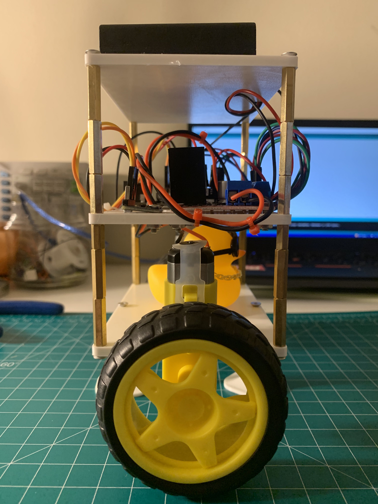

# egg-robot
Self-balancing PID controlled robot on the Arduino.

egg is a robot that is capable of self-balancing. This is done through a PID controller that takes in IMU data that determines its pitch angles and outputs motor values. The idea is to correct the error between the actual pitch angle to a setpoint. The setpoint angle is the angle where the robot is standing vertically. The PID controller then takes this error and outputs values that the motors can use. Three different components are at play when it comes with PID controllers. Proportional, integral and derivative components which include their own gains (Kp, Ki, Kd). These gains need to be tuned accordingly in order to achieve self-balancing.

| egg Front View | dumpling Side View |
|:--------:|:-----------------:|
|||

### Parts List

- Arduino
- 2x TT motors
- L298N motor driver
- MPU6050 IMU
- 6V Battery pack
- 3D printed chassis
  - Base plate
  - Top plate for components
  - Top plate for battery
  - Motor mounts for base plate
  - Display stands
- Standoffs
- Various harnessing

### Tuning strategy

- Set Ki and Kd to 0.
- Increase Kp gain
  - Too low then the robot can't recover
  - Too high then the robot starts oscillating
  - A good Kp will allow the robot to stand almost on its own
- Once Kp is chosen, increase Kd. An increase in Kd will mitigate oscillations but if set too high then it will cause jitters.
- A PD controller will have steady-state error and this can be seen when the robot tilts one way consistently.
- Increase Ki until steady state error is gone.

### Resources

- [PID](http://brettbeauregard.com/blog/2011/04/improving-the-beginners-pid-introduction/)
- [PID tuning guide](https://www.youtube.com/watch?v=uyHdyF0_BFo)
- [MPU6050](https://lastminuteengineers.com/mpu6050-accel-gyro-arduino-tutorial/)
- [L298N](https://lastminuteengineers.com/l298n-dc-stepper-driver-arduino-tutorial/)
